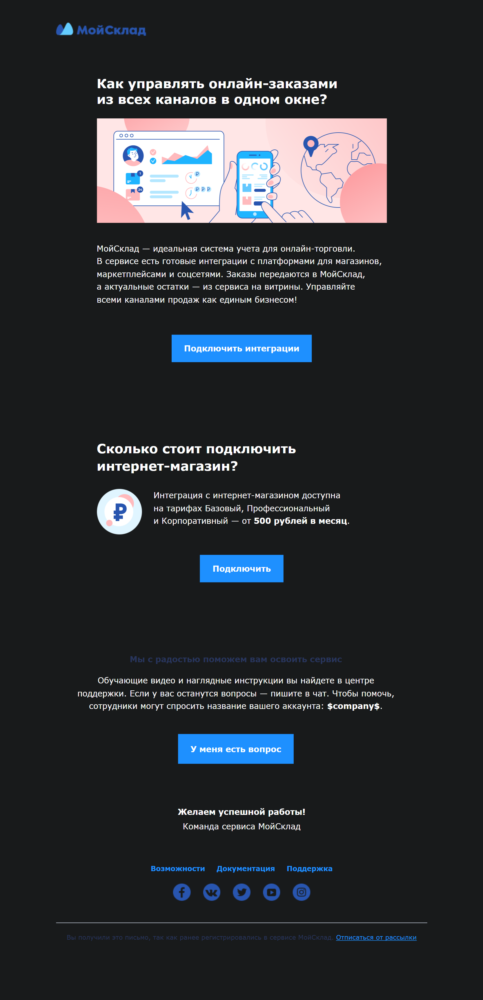

# Тестовое задание по email-верстке

## Описание

Проект выполнен в рамках тестового задания. Основной задачей было создание адаптивного email-шаблона с учетом корректного отображения во всех популярных почтовых клиентах, включая Outlook.

## Основные требования

- **Адаптивная верстка:** корректное отображение на мобильных и десктопных устройствах.
- **Кросспочтовая совместимость:** поддержка всех популярных почтовых клиентов.
- **Использование фантомных таблиц:** для обеспечения корректного отображения в Outlook.
- **Чистый код:** весь результат выполнен без подключения внешнего CSS.

## Используемые технологии

- **HTML**
- **CSS (inline-стили)**
- Табличная верстка для корректной работы в почтовых клиентах.

## Скриншоты

  
  

